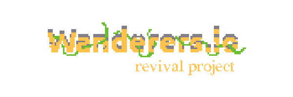

<b>A revival project for the beloved online game, wanderers.io.</b>
 
Originally created by Rezoner, the project was taken offline in late 2023 ~ early 2024, possibly due to bugs, vulnerabilities and domain renewal. This project aims at preserving, rebuilding and maintaining the game.

## How is the game being preserved?

Since the source code is not publicly available, the compiled [script](src/script.js) is our only hope at reverse-engineering the frontend. The backend, of course, will need a full redevelopment, which has been started.
 
To make it easier to reverse-engineer and maintain in the future, the client is written in Typescript and utilizes SvelteKit. The backend is written in Typescript and runs on Node.js.

## I have audios/images/other assets!

Fortunately, wanderers.io loaded about 30 assets on startup, which gives us a decent starting point. A Wayback Machine archive can be accessed [here](https://web.archive.org/web/20231028194441/https://wanderers.io/) (links to wanderers.io internal version [4505](#what-are-the-different-version-numbers)). By using the developer tools, you can find assets that are initially loaded in. These have all been extracted and saved in `static/`.

If you have any saved archives of **the fully loaded game** that has image/audio assets, please create a pull request with the assets in their respective directories.

You can see a list of assets that have been collected [here](assets.md).

## Links

### Original community forums

- Subreddit - https://www.reddit.com/r/wanderersio/
- Userecho - https://wanderers.userecho.com/

### Gameplay footage

- "Wanderers.io in 2021." - https://www.youtube.com/watch?v=RB0Z-ff281U

### Archives

- Tutorial page - https://web.archive.org/web/20211011080154/https://wanderers.io/tutorial/
- Press kit - https://web.archive.org/web/20241016013313/https://wanderers.io/presskit/

### Libraries

Fortunately, the libraries used in wanderers.io are public on Rezoner's GitHub.

- https://github.com/rezoner/playground
- https://github.com/rezoner/SoundOnDemand
- https://github.com/rezoner/ease
- https://github.com/rezoner/CanvasQuery

The following are some links to the documentation for these libraries.

- CanvasQuery Library - https://canvasquery.com/
- PlaygroundJS Library - https://web.archive.org/web/20160802195253/http://playgroundjs.com/libs/sound-on-demand/setup

## Development FAQs

### Why does the web.archive.org script.js look different?

Wayback Machine modifies scripts and HTML to allow for replaying, and for links to properly redirect to an archive.

### Why refactor PlaygroundJS into Typescript?

The PlaygroundJS library contains a lot of old code written for legacy browser JavaScript. By rewriting PlaygroundJS, the library can be cleaned up using modern TypeScript. It also allows for better maintainability, since everything can be statically typed.

### What are the different version numbers?

From what I have found, the latest version was **4505**. This can be found at line `2422` in script.js.

### Almost 2000 assets! Is it really possible to get them all?

Unless someone has a full archive of the game when it's loaded, this will be a tough challenge. My initial plan was to find every screenshot of the game out there, and redraw each asset in Aseprite. While this could be a viable option, it's tedious and I lack the proper skills for achieving this.

I have also contacted Rezoner in the small chance he would be willing to send over source assets, but to no avail.

So... If you are an artist or skilled in recreating pixel art, please create a PR with your work.

Also, regarding the other assets such as sounds, shaders and JSONs, I'm not too sure yet. Fortunately, almost all of the JSONs have been collected, and sounds aren't a top priority. Shaders, however, will also be a challenge and depends on how the code uses them.

### Ships, divers and guns?

As stated in the [Plans section of the presskit](https://web.archive.org/web/20211022200419/https://www.wanderers.io/presskit/#Plans), Rezoner planned to expand the game into a Sci-Fi spinoff. While not certain, it is likely these assets and references in script.js are a part of this expansion.

### How does this project fall with copyright?

While I am not a lawyer, nor professionally informed in copyright law, I understand that game-preservation typically bypasses most copyright issues. However, this is not guaranteed, nor professional advice.
